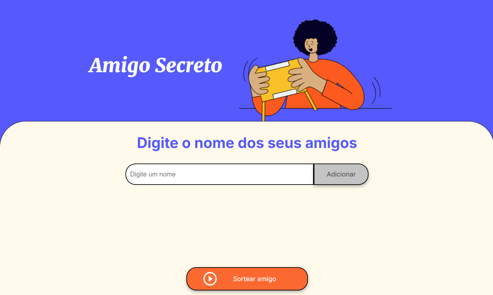

<h1> CHALLENGE: Amigo Secreto </h1>

  
  
  
  

<h3>Resumo do projeto</h3>

Projeto realizado para atender o Challenge do curso Iniciante em Programação G8 - ONE
Realizado na Alura, visando a prática com a linguagem Javascript.

Programa WEB para sorteio de nomes para o amigo secreto.

<b>Imagem:</b> 

🔨 Funcionalidades do projeto

 - Declarar uma variável do tipo array, que armazenará os nomes dos amigos inseridos.
 
 - Função que permita ao usuário inserir um nome no campo de texto e adicioná-lo à lista de amigos criada anteriormente.
   -  Capturar o valor do campo de entrada: Utilize document.getElementById ou document.querySelector para obter o texto inserido pelo usuário.
   -  Validar a entrada: Implemente uma validação para garantir que o campo não esteja vazio.
   -  Se estiver vazio, exiba um alerta com a mensagem de erro: "Por favor, insira um nome."
   -  Atualizar o array de amigos: Se o valor for válido, adicione-o ao array que armazena os nomes dos amigos usando o método .push().
   -  Limpar o campo de entrada: Após adicionar o nome, redefina o campo de texto para uma string vazia.
    
 - Função que percorra o array amigos e adicione cada nome como um elemento <li> dentro de uma lista HTML.
   Use innerHTML para limpar a lista antes de adicionar novos elementos.
   -  Obter o elemento da lista: Utilize document.getElementById() ou document.querySelector() para selecionar a lista onde os amigos serão exibidos.
   -  Limpar a lista existente: Defina lista.innerHTML = "" para garantir que não haja duplicados ao atualizar.
   -  Percorrer o array: Use um loop for para percorrer o array amigos e criar elementos de lista (<li>) para cada nome.
   -  Adicionar elementos à lista: Para cada amigo, crie um novo elemento de lista.
     
 - Função que selecione aleatoriamente um dos nomes armazenados no array amigos.
   Use Math.random() e Math.floor() para obter um índice aleatório.
   -  Validar que há amigos disponíveis: Antes de sortear, verificar se o array amigos não está vazio.
   -  Gerar um índice aleatório: Usar Math.random() e Math.floor() para selecionar um índice aleatório do array.
   -  Obter o nome sorteado: Utilizar o índice aleatório para acessar o nome correspondente no array.
   -  Mostrar o resultado: Atualizar o conteúdo do elemento de resultado usando document.getElementById() e innerHTML para exibir o amigo sorteado.

✔️ Técnicas e tecnologias utilizadas

   - Javascript
   - html
   - css

📁 Acesso ao projeto

   - Você pode baixar os arquivos do projeto clicando [aqui](https://github.com/mauricioaalmeida/challenge-amigo-secreto_pt-main/archive/refs/heads/main.zip)

   - Você pode testar o projeto clicando [aqui](https://challenge-amigo-secreto-pt-main-seven.vercel.app/) <i>(* Powered by [Vercel](https://vercel.com/docs) )</i>

# Autor

[  Mauricio Andre de Almeida](https://github.com/mauricioaalmeida) 
